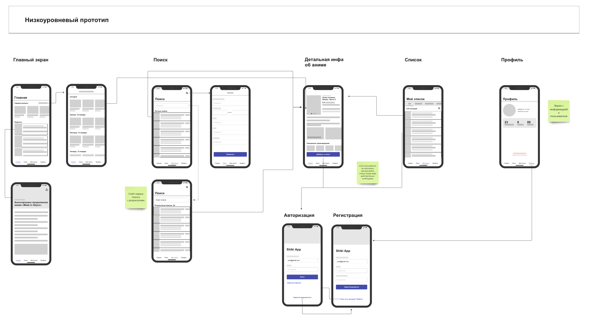

[![Swift Version][swift-image]][swift-url]
[![License][license-image]][license-url]
[![Platform][platform-image]][platform-url]
[![PRs][prs-image]][prs-url]

[swift-image]: https://img.shields.io/badge/Swift-5.7-orange.svg
[swift-url]: https://swift.org/
[license-image]: https://img.shields.io/badge/License-MIT-blue.svg
[license-url]: LICENSE
[platform-image]: https://img.shields.io/badge/Platform-ios-purple.svg
[platform-url]: http://cocoapods.org/pods/LFAlertController
[prs-image]: https://img.shields.io/badge/PRs-welcome-brightgreen.svg?style=flat-square
[prs-url]: http://makeapullrequest.com

# ShikiApp
 

  
  

  Приложение для просмотра информации об аниме, манге и ранобэ на основе данных сайта <a href="https://shikimori.one"> Shikimori </a> 
Позволяет добавлять тайтлы в списки просмотра, читать новости из мира аниме, просматривать календарь выхода новых серий, быстро находить информацию о тайтлах и просматривать трейлеры. 
Если не знаете что посмотреть, воспользуйтесь нашим гибким поиском по сезонам, жанрам или смотрите что в топе прошлого сезона или за все время.
  

## Функции

:white_check_mark: управлять списками просмотров \
:white_check_mark: читать новости из мира аниме \
:o: просматривать календарь выхода новых серий \
:white_check_mark: находить информацию об аниме, манге и ранобэ \
:white_check_mark: смотреть трейлеры, опенинги, эндинги

## Наш Style-guide
Для ознакомления с нашим style guide посмотрите файл
 :page_facing_up:[**`Style-guide`**](style-guides.md)

## Стек и архитектура
- В качестве архитектуры был выбран `MVP`, так как это позволяет проще покрывать функционал unit test'ами.
- Верстка - `UIKit`, кодом с использованием `Autolayouts` без сторонних библиотек.
- Хранение `OAuth2` токена - `KeyChain`, в планах так же добавить хранение настроек пользователя в `UserDefaults`.
- Все данные приложения хранятся в `CoreData` для отображения части данных без подключения к сети Интернет. Так же у нас в планах расширение функционала, с использованием данных, которые хранятся в `CoreData`.
- Просмотр видео реализован с помощью `WebKit`, так же мы добавили deeplink для просмотра видео в приложении Youtube или просмотр в Safari, если у пользователя не установлен Youtube.
- Работу с сетью осуществляем с помощью `URLSession`, описание запросов можно найти ниже, в подразделе API.

### API 
<a href="https://shikimori.one/api/doc">Для логина и данных</a>\
<a href="https://shikimori.one/api/doc/2.0/user_rates">Для списка просмотренного юзера</a>

### Требования

- iOS 15.0+
- Xcode 14.2

# Ресурсы  
### Карта экранов

Подробнее смотрите карту экранов в Miro :point_down:

### Дизайн 
Вы можете посмотреть отрисованный дизайн нашего приложение в Figma :point_down:

# Вклад
### Наша iOS команда
<a href="https://github.com/speaker378">Сергей</a>\
<a href="https://github.com/ads63">Алексей</a>\
<a href="https://github.com/KonstantinShmondrik">Константин</a>\
<a href="https://github.com/December11">Алла</a>\
<a href="https://github.com/mpopsicle235111">Антон</a>

Мы будем рады, если вы сделаете вклад в **ShikiApp**, проверьте файл :page_facing_up:[**`LICENSE`**](resources/LICENSE.md) для получения дополнительной информации.
